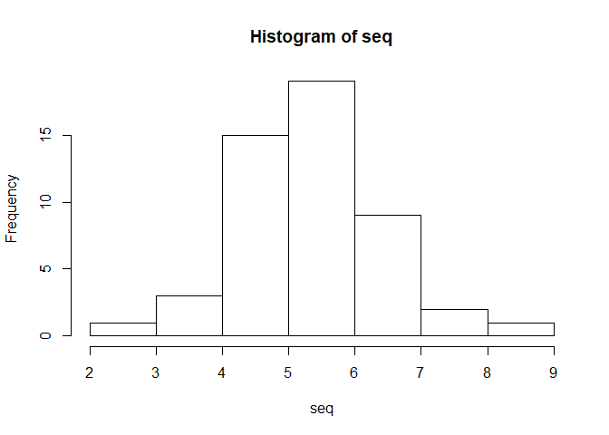
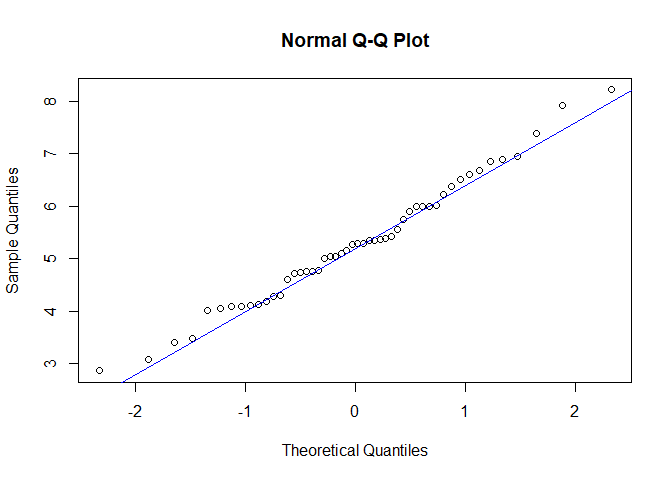
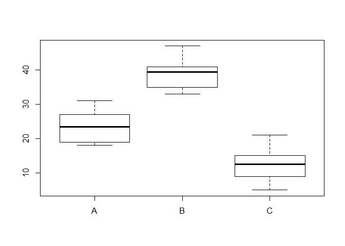
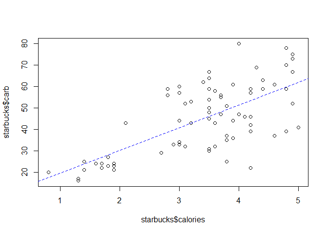
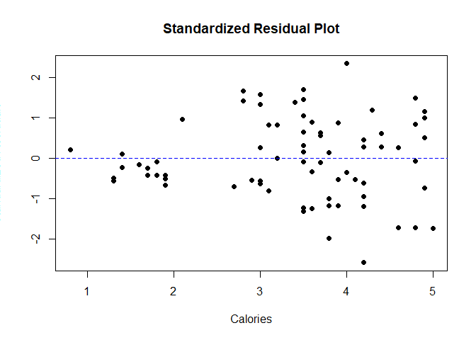
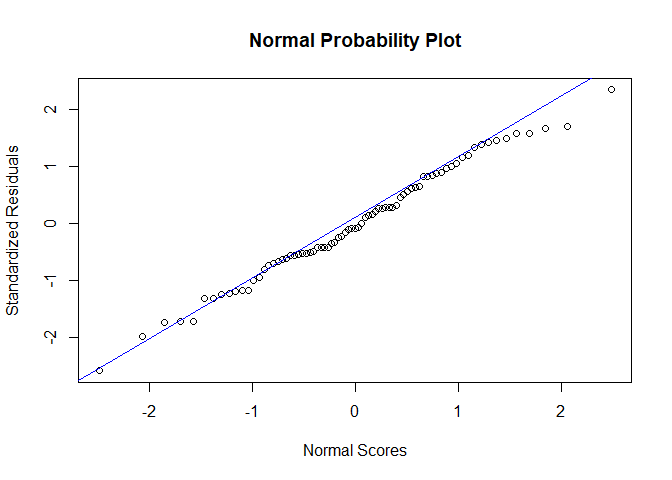
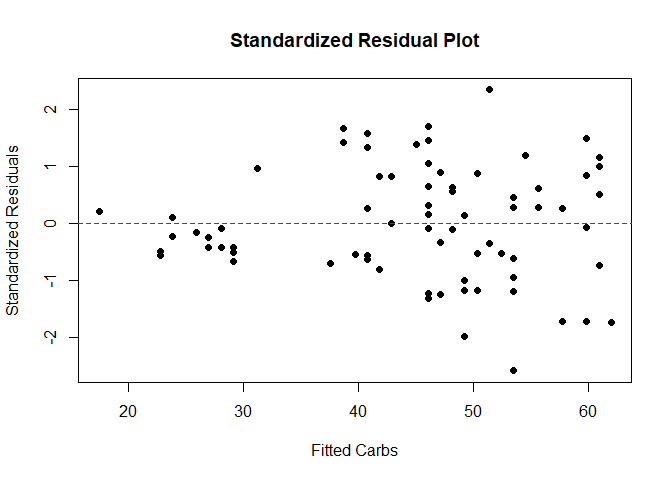
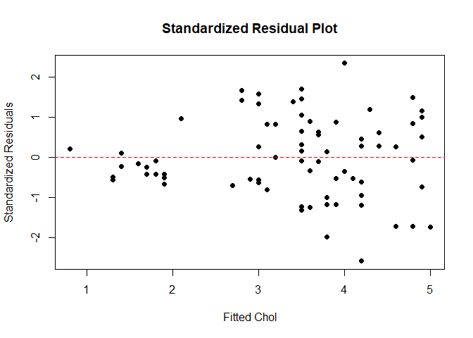

CookBook
========

``` r
library(readxl)
library(ggplot2)
```

Statistical Inference
---------------------

Notes on statistical inference made for learning statistics for data scientists

Estimation
----------

### Confidence Interval for true mean

**Assumptions:**

1.  Random Sampling from DGP
2.  Stability in DGP
3.  If n&lt; 30 =&gt; Normal Distribution

``` r
Congress <- read_excel("Piracy.xlsx", col_names = TRUE)

mean = 30.7833
sd = 1.7862
size = 12
sample_sd = sd/sqrt(size)

lower = mean + qt(0.05, size-1)*sample_sd
higher =mean -qt(0.05, size-1)*sample_sd
lower
```

    ## [1] 29.85729

``` r
higher
```

    ## [1] 31.70931

### Confidence Interval estimation for proportion

**Assumptions:**

1.  Random Sampling from DGP
2.  Stability in DGP

``` r
poll <- read_excel('Poll.xlsx', col_names = TRUE)
table(poll)
```

    ## poll
    ##   1   2 
    ## 358 407

#### Wilscon score interval method - generally preferred

prop.test can be used for testing the null that the proportions (probabilities of success) in several groups are the same, or that they equal certain given values.

``` r
prop.test(358, (358+407), conf.level = .95)
```

    ## 
    ##  1-sample proportions test with continuity correction
    ## 
    ## data:  358 out of (358 + 407), null probability 0.5
    ## X-squared = 3.0118, df = 1, p-value = 0.08266
    ## alternative hypothesis: true p is not equal to 0.5
    ## 95 percent confidence interval:
    ##  0.4322160 0.5040576
    ## sample estimates:
    ##         p 
    ## 0.4679739

#### Exact binomial estimation

Performs an exact test of a simple null hypothesis about the probability of success in a Bernoulli experiment. Here hypothesized probability of success is provided as parameter. 0.5 in this case

``` r
binom.test(358, (358+407), 0.5, conf.level = .9)
```

    ## 
    ##  Exact binomial test
    ## 
    ## data:  358 and (358 + 407)
    ## number of successes = 358, number of trials = 765, p-value =
    ## 0.08259
    ## alternative hypothesis: true probability of success is not equal to 0.5
    ## 90 percent confidence interval:
    ##  0.4377759 0.4983554
    ## sample estimates:
    ## probability of success 
    ##              0.4679739

### Calculating CI directly from sample

The file WaitTime.xlsx contains data of wait times (in minutes) for a random sample of a bank’s customers. Find a 90% confidence interval for the mean wait time at the bank.

**t.test** - Performs one and two sample t-tests on vectors of data and also give CI. There are two kinds of hypotheses for a one sample t-test, the null hypothesis and the alternative hypothesis. The alternative hypothesis assumes that some difference exists between the true mean (μ) and the comparison value (m0), whereas the null hypothesis assumes that no difference exists. The comparison value (m0) can be specified with mu parameter below, default is 0. The value of mu does not affect the CI, as CI is the estimation of true mean using leveraging the given sample.

``` r
waiting = read_excel('WaitTime.xlsx')
t.test(waiting$WaitTime, mu = 0, conf.level = .90)
```

    ## 
    ##  One Sample t-test
    ## 
    ## data:  waiting$WaitTime
    ## t = 22.057, df = 99, p-value < 2.2e-16
    ## alternative hypothesis: true mean is not equal to 0
    ## 90 percent confidence interval:
    ##  5.048978 5.871022
    ## sample estimates:
    ## mean of x 
    ##      5.46

``` r
t.test(waiting$WaitTime, mu = mean(waiting$WaitTime), conf.level = .90)
```

    ## 
    ##  One Sample t-test
    ## 
    ## data:  waiting$WaitTime
    ## t = 0, df = 99, p-value = 1
    ## alternative hypothesis: true mean is not equal to 5.46
    ## 90 percent confidence interval:
    ##  5.048978 5.871022
    ## sample estimates:
    ## mean of x 
    ##      5.46

An equivalent alternative to t.test() is manual calculation as done below

``` r
sample_mean = mean(waiting$WaitTime)
sample_sd = sd(waiting$WaitTime)
sampled_sd = sample_sd/sqrt(length(waiting$WaitTime))

sample_mean+qt(0.05, length(waiting$WaitTime-1))*sampled_sd
```

    ## [1] 5.049016

``` r
sample_mean-qt(0.05, length(waiting$WaitTime-1))*sampled_sd
```

    ## [1] 5.870984

-   \*Interpretation\*\*: There is a 90% chance that the interval we got captures the true mean waiting time\*

Hypothesis Testing
------------------

### Errors

Accepting null hypothesis when alternative hypothesis is true -&gt; Type 1

Accepting alternative hypothesis when null hypothesis is true -&gt; Type 2

The probability of marking Type 1 error is Alpha (accepting Ha)

The probability of marking Type 2 error is Beta (failure in rejecting Ho)

The closer is true mean to the hypothetical mean, the higher the value of Beta. We can only control Type 1 error through desired level of significance. Hence, design hypothesis such that the error we want to control is the Type 1 error. \*\* Statisticians Dodge: \*\* Since we cannot control Type 2 error. (ie. Accepting Ho when Ha is true). Never draw the conclusion of accepting Ho, instead what we can conclude is that: 'we do not reject Ho) ie: Failed to reject the Null Hypothesis P value is the probability of getting the sample result if Ho were true

### T - Test

The one sample t-test is a statistical procedure used to determine whether a sample of observations could have been generated by a process with a specific mean. Suppose you are interested in determining whether an waiting time at a clinic is less then 5 min. To test this hypothesis, you could collect a sample of waiting times, measure their weights, and compare the sample with a value of five using a one-sample t-test.

**Manually calculating T value using the formula**
$$
t = \\frac{(\\text{mean}\_f - \\text{mean}\_m) - \\text{expected difference}}{SE}  \\\\
~\\\\
~\\\\
SE = \\sqrt{\\frac{sd\_f^2}{n\_f} + \\frac{sd\_m^2}{n\_m}}  \\\\
~\\\\
~\\\\
\\text{where, }~~~df = n\_m + n\_f - 2
$$
 P value of a T statistic can then be calculated as

``` r
se = sd(waiting$WaitTime)/sqrt(length(waiting$WaitTime))
t= (mean(waiting$WaitTime)-5)/se
df=length(waiting$WaitTime)-1
pt(t, df)
```

    ## [1] 0.9669472

**Assumptions:**

1.  Random Sampling from DGP
2.  Stability in DGP
3.  If n&lt; 30 =&gt; Normal Distribution
4.  Null hypothesis is true

Test if the waiting time is less than 5 min
Null hypothesis -&gt; true mean is greater then and equal to 5
Alt. hypothesis -&gt; true mean is less than 5

``` r
t.test(waiting$WaitTime, alternative = 'less', mu=5)
```

    ## 
    ##  One Sample t-test
    ## 
    ## data:  waiting$WaitTime
    ## t = 1.8582, df = 99, p-value = 0.9669
    ## alternative hypothesis: true mean is less than 5
    ## 95 percent confidence interval:
    ##      -Inf 5.871022
    ## sample estimates:
    ## mean of x 
    ##      5.46

The likely hood of getting sample statistic as extreme as 1.85 in 0.966 if the true mean waiting time is greater then or equal to 5

The **significance level** is the probability of obtaining a result as extreme as, or more extreme than, the result actually obtained when the null hypothesis is true

The significance level and confidence level are the complementary portions in the normal distribution.

### Testing normality

Test normality for generated numbers

**Assumptions:**

1.  Random Sampling from DGP
2.  Stability in DGP

#### Using histogram

``` r
seq <- rnorm(50,5,1)
hist(seq)
```



#### Using qq plot

``` r
qqnorm(seq)
qqline(seq, col = "blue")
```



#### Using Shapiro Wilk test

Null hypothesis -&gt; distribution is normal

Alt. hypothesis -&gt; distribution is not normal

``` r
shapiro.test(seq)
```

    ## 
    ##  Shapiro-Wilk normality test
    ## 
    ## data:  seq
    ## W = 0.96431, p-value = 0.1347

P-value being so high, we can conclude that: We fail to reject null hypothesis.
Hence, our assumption of distribution being normal is not rejected.

Definition of P-Value: Given a null hypothesis and sample evidence of size n, the p-value is the probability of getting a sample evidence that is equally or more unfavorable to the null hypothesis while the null hypothesis is actually true.

Tables
------

### Chi-Square distribution

The Chi Square distribution is the distribution of the sum of squared standard normal deviates. The degrees of freedom of the distribution is equal to the number of standard normal deviates being summed

Probability of getting X-square value of less then or equal to 5 is

``` r
pchisq(5,1)
```

    ## [1] 0.9746527

X-square value associated with cumulative probability of 0.9746527 is

``` r
qchisq(0.9746527,1)
```

    ## [1] 5.000001

*The **chi-squared test** is used to determine whether there is a significant difference between the expected frequencies and the observed frequencies in one or more categories.*

### One-Sample Goodness of fit test (Using Chi Square distribution) / Multinomial Test

Chi-Square goodness of fit test is a non-parametric test that is used to find out how the observed value of a given phenomena is significantly different from the expected value. In Chi-Square goodness of fit test, the term goodness of fit is used to compare the observed sample distribution with the expected probability distribution.

Null hypothesis -&gt; There is no significant difference between the observed and the expected value.

Alt. hypothesis -&gt; There is a significant difference between at least one of them

**Assumptions:**

1.  Random Sampling from DGP
2.  Stability in DGP
3.  Expected value for each group is at least 5

``` r
gas<- read_excel("Gasoline.xlsx", col_names=TRUE)
head(gas)
```

    ## # A tibble: 6 x 3
    ##   Owner `Second-last`  Last
    ##   <dbl>         <dbl> <dbl>
    ## 1     1             3     3
    ## 2     2             4     3
    ## 3     3             2     2
    ## 4     4             3     3
    ## 5     5             4     3
    ## 6     6             2     4

``` r
table(gas$`Second-last`, gas$Last)
```

    ##    
    ##      1  2  3  4
    ##   1 47 14 27 14
    ##   2 18 63 33 13
    ##   3 26 48 59 16
    ##   4 30 23 29 53

``` r
result <- chisq.test(table(gas$`Second-last`, gas$Last))
result
```

    ## 
    ##  Pearson's Chi-squared test
    ## 
    ## data:  table(gas$`Second-last`, gas$Last)
    ## X-squared = 114.12, df = 9, p-value < 2.2e-16

Check expected values are greater then equal to 5

``` r
result$expected
```

    ##    
    ##            1        2        3        4
    ##   1 24.05848 29.42690 29.42690 19.08772
    ##   2 29.95517 36.63938 36.63938 23.76608
    ##   3 35.14425 42.98635 42.98635 27.88304
    ##   4 31.84211 38.94737 38.94737 25.26316

Cell-by-cell contributions to observed Chi-Square value

``` r
(result$residuals)^2
```

    ##    
    ##              1          2          3          4
    ##   1 21.8764183  8.0874729  0.2001518  1.3561017
    ##   2  4.7713302 18.9654562  0.3614979  4.8770563
    ##   3  2.3792598  0.5847585  5.9655403  5.0642490
    ##   4  0.1065681  6.5298009  2.5406117 30.4527412

Relationships
-------------

Null hypothesis -&gt; No Relationship

Alt. hypothesis -&gt; Relationship

Looking at relationships between variables to understand and and predict what is going on.

### Twoway Table

| Response | Predictor |
|----------|-----------|
| Nominal  | Nominal   |

Ho:No relationship exists; probabilistic independence

Ha: Relationship exists; probabilistic dependence

Ex. Transit Railroads is interested in the relationship between travel distance and the ticket class purchased.
A random sample of 200 passengers is taken.

``` r
transit<-read_excel("Transit.xlsx", na="NA", col_names = TRUE)
table(transit)
```

    ##         Distance
    ## Class    1-100 101-200 201-300 301-400 401-500
    ##   First      6       8      15      21      10
    ##   Second    14      16      17      14       6
    ##   Third     21      18      16      12       6

``` r
result <- chisq.test(table(transit))
result
```

    ## 
    ##  Pearson's Chi-squared test
    ## 
    ## data:  table(transit)
    ## X-squared = 15.923, df = 8, p-value = 0.0435

``` r
# cell-by-cell contributions to observed Chi-Square value: ((O-E)^2)/E
result$residuals
```

    ##         Distance
    ## Class         1-100    101-200    201-300    301-400    401-500
    ##   First  -1.7963377 -1.2959032  0.1581139  1.8375516  1.3234482
    ##   Second  0.0715042  0.5145295  0.2294271 -0.4397685 -0.5046460
    ##   Third   1.5600514  0.6819306 -0.3631420 -1.2446101 -0.7163714

### Oneway ANOVA

| Response | Predictor |
|----------|-----------|
| Interval | Nominal   |

**F - Distribution**: Generally arises from a statistic that involves a ratio of variances. pf & qf functions in R for handling F-distribution

F statistic is the value we receive when we run an ANOVA test on different groups to understand the differences between them. The F statistic is given by the ratio of between group variability to within group variability

If there are two predictors, then it becomes Twoway ANOVA
Oneway ANOVA is a test of relationship between a interval level response variable and nominal level predictor variable. Or can also be expressed as a test of multiple means.

**Assumptions:**

1.  Random Sampling from DGP
2.  Stability in DGP
3.  For each level of predictor variable, in n &lt; 30 then normally distributed
4.  Standard deviation is same for all the groups (Evaluate with Leven's test)

Ho:No relationship exists; Distribution is identical across all categories

Ha: Relationship exists; Difference in means across at-least two categories

``` r
chol<- read_excel("Cholesterol.xlsx", col_names=TRUE)
head(chol)
```

    ## # A tibble: 6 x 2
    ##   Drug  CholReduction
    ##   <chr>         <dbl>
    ## 1 A                22
    ## 2 A                31
    ## 3 A                19
    ## 4 A                27
    ## 5 A                25
    ## 6 A                18

``` r
fit <-  aov(CholReduction ~ Drug, data=chol)
summary(fit)
```

    ##             Df Sum Sq Mean Sq F value   Pr(>F)    
    ## Drug         2 2152.1  1076.1   40.79 8.59e-07 ***
    ## Residuals   15  395.7    26.4                     
    ## ---
    ## Signif. codes:  0 '***' 0.001 '**' 0.01 '*' 0.05 '.' 0.1 ' ' 1

DF = (k-1), (n-k) = 2, 15 Mean Sq, gives MST (above) and MSE (below) Sum Sq, gives SST (above) and SSE (below) The probability of getting a sample statistic as or more extreme then 40.79 is the P value. Which is extremely low. Hence, there is a significant relationship between means of at least 2 drugs.

``` r
boxplot(CholReduction ~ Drug, data=chol)
```



Use Tukey HSD test to determine which drugs have relationship.

#### Tukey HSD (Honest Significance Difference) test

Studentised range distribution is used to test each pairwise difference

**Assumptions:** Same as ANOVA

1.  Random Sampling from DGP
2.  Stability in DGP
3.  For each level of predictor variable, in n &lt; 30 then normally distributed
4.  Standard deviation is same for all the groups (Evaluate with Leven's test)

Ho:No relationship exists: μi = μj for each i, j being checked

Ha: Relationship exists: μi ≠ μj

``` r
TukeyHSD(fit, conf.level = .9)
```

    ##   Tukey multiple comparisons of means
    ##     90% family-wise confidence level
    ## 
    ## Fit: aov(formula = CholReduction ~ Drug, data = chol)
    ## 
    ## $Drug
    ##          diff        lwr       upr     p adj
    ## B-A  15.50000   8.916894  22.08311 0.0002841
    ## C-A -11.16667 -17.749773  -4.58356 0.0049961
    ## C-B -26.66667 -33.249773 -20.08356 0.0000006

Ex. here. B is greater then A buy 15.4 There is a probability of 0.00028 or more to get a sample statistic of 15.5 if Ho where true Hence, all three of them differ significantly

#### Leven's test

Whenever we wish to determine if variances are all equal or not across different groups

**Assumptions:**

1.  Random Sampling from DGP
2.  Stability in DGP

Ho: σ1 = σ2 = … = σk ; k independent samples/sets of responses

Ha: At least one pair is not equal

``` r
library('car')
```

    ## Loading required package: carData

``` r
leveneTest(chol$CholReduction, chol$Drug)
```

    ## Levene's Test for Homogeneity of Variance (center = median)
    ##       Df F value Pr(>F)
    ## group  2  0.0882 0.9161
    ##       15

### Linear Regression

| Response | Predictor             |
|----------|-----------------------|
| Interval | At least one Interval |

**Assumptions:**

1.  Random Sampling from DGP
2.  Stability in DGP
3.  εi ~ Normal (Mean 0, SD σ) constant, over all possible values of the predictors. We can use the following to evaluate this assumption
    -   Standardized Residuals are normally distributed
    -   Mean 0, SD fixed across predictors. Plot St. residual plots for individual predictors (Xi) and predicted values (Y hat)

We are interested in predicting the amount of carbohydrates (in grams) for a menu item based on its calorie content (measured in 100s).

``` r
starbucks <- read_excel('starbucks.xlsx')
head(starbucks)
```

    ## # A tibble: 6 x 7
    ##   item                        calories   fat  carb fiber protein type  
    ##   <chr>                          <dbl> <dbl> <dbl> <dbl>   <dbl> <chr> 
    ## 1 8-Grain Roll                     3.5     8    67     5      10 bakery
    ## 2 Apple Bran Muffin                3.5     9    64     7       6 bakery
    ## 3 Apple Fritter                    4.2    20    59     0       5 bakery
    ## 4 Banana Nut Loaf                  4.9    19    75     4       7 bakery
    ## 5 Birthday Cake Mini Doughnut      1.3     6    17     0       0 bakery
    ## 6 Blueberry Oat Bar                3.7    14    47     5       6 bakery

``` r
attach(starbucks)
linefit <- lm(carb ~ calories, data = starbucks)
plot(starbucks$calories, starbucks$carb)
abline(linefit,lty=2, col="blue")
```



#### Model as a whole doing something or not

Ho:No relationship exists; β1 = β2 =…=βk = 0

Ha: Relationship exists; at least one predictor βi ≠ 0

ANOVA is used to test this

``` r
anova(linefit)
```

    ## Analysis of Variance Table
    ## 
    ## Response: carb
    ##           Df  Sum Sq Mean Sq F value    Pr(>F)    
    ## calories   1  9486.4  9486.4  62.772 1.673e-11 ***
    ## Residuals 75 11334.3   151.1                      
    ## ---
    ## Signif. codes:  0 '***' 0.001 '**' 0.01 '*' 0.05 '.' 0.1 ' ' 1

#### Testing Individual Predictors

Ho:No relationship exists; βi = 0, 1 ≤ i ≤ k

Ha: Relationship exists; βi ≠ 0

For each predictor two tailed T - test is used to test this

``` r
summary(linefit)
```

    ## 
    ## Call:
    ## lm(formula = carb ~ calories, data = starbucks)
    ## 
    ## Residuals:
    ##     Min      1Q  Median      3Q     Max 
    ## -31.477  -7.476  -1.029  10.127  28.644 
    ## 
    ## Coefficients:
    ##             Estimate Std. Error t value Pr(>|t|)    
    ## (Intercept)    8.944      4.746   1.884   0.0634 .  
    ## calories      10.603      1.338   7.923 1.67e-11 ***
    ## ---
    ## Signif. codes:  0 '***' 0.001 '**' 0.01 '*' 0.05 '.' 0.1 ' ' 1
    ## 
    ## Residual standard error: 12.29 on 75 degrees of freedom
    ## Multiple R-squared:  0.4556, Adjusted R-squared:  0.4484 
    ## F-statistic: 62.77 on 1 and 75 DF,  p-value: 1.673e-11

#### Assumption Evaluation

##### Standardized residuals normality check

**Standardized residuals plot**

``` r
linefit.stres <- rstandard(linefit)

plot(starbucks$calories, linefit.stres, pch = 16, main = "Standardized Residual Plot", xlab = "Calories", ylab = "Standardized Residuals
")
abline(0,0, lty=2, col="blue")
```



**Normal probability plot (QQPlot)**

``` r
qqnorm(linefit.stres, main = "Normal Probability Plot", xlab = "Normal Scores", ylab = "Standardized Residuals")
qqline(linefit.stres, col = "blue")
```



**Shapiro Wilk Normality test**

``` r
shapiro.test(linefit.stres)
```

    ## 
    ##  Shapiro-Wilk normality test
    ## 
    ## data:  linefit.stres
    ## W = 0.99032, p-value = 0.832

#### Standardized Residual Plot - on fitted values

``` r
plot(linefit$fitted.values, linefit.stres, pch = 16, main = "Standardized Residual Plot", xlab = "Fitted Carbs", ylab = "Standardized Residuals")
abline(0,0, lty=2, col="red")
```



#### Standardized Residual Plot - on calories

``` r
plot(starbucks$calories, linefit.stres, pch = 16, main = "Standardized Residual Plot", xlab = "Fitted Chol", ylab = "Standardized Residuals")
abline(0,0, lty=2, col="red")
```



#### Confidence Interval for Estimates (βi)

``` r
confint(linefit, level=.9)
```

    ##                  5 %     95 %
    ## (Intercept) 1.039446 16.84767
    ## calories    8.374277 12.83190

#### Confidence Interval Estimation of Mean of Y

``` r
predict(linefit,data.frame(calories=4.5), interval ="confidence", level = .80)
```

    ##        fit      lwr      upr
    ## 1 56.65746 54.01528 59.29964

#### Prediction Interval Estimation of Y

``` r
predict(linefit, data.frame(calories=4.5), interval="predict", level = .80)
```

    ##        fit     lwr      upr
    ## 1 56.65746 40.5449 72.77002
